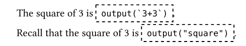
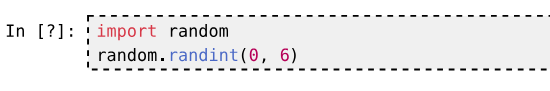

# Tutorial 3: Exporting and Executing Code Blocks

Now instead of writing code cells in a notebook file, we want to write code blocks directly in the Typst file. We want these code blocks to be executed, and the result included in the document.

This can be done with Callisto: we can use `typst eval` to export code blocks to a notebook file, and `jupyter-nbconvert` to execute the notebook.  Callisto will automatically read the results from the exported notebook. The notebook file works like a "cache" for the execution.

Let's see in details how this works.

## A First Document with Executed Blocks

We start with a blank file `document.typ`. We must configure Callisto functions with the notebook filename we want to use and the Jupyter kernel that will execute the code blocks. To find the available kernels we can use the following command in the terminal:

```txt
$ jupyter kernelspec list
Available kernels:
  ir            /home/user/.local/share/jupyter/kernels/ir
  julia-1.11    /home/user/.local/share/jupyter/kernels/julia-1.11
  python3       /usr/share/jupyter/kernels/python3
```

In this example we have the `ir` kernel for R, the `julia-1.11` kernel for Julia and the `python3` kernel for Python. Let's configure Callisto to use the Python kernel:

```typst
#import "@preview/callisto:0.3.0"

#let (execute, stage-notebook) = callisto.config(
  nb: path("export.ipynb"),
  kernel: "python3",
)

#stage-notebook()
```

The last line prepares the data for the exported notebook.

We now need to specify which code blocks should be executed. This can be done with a show rule that selects all raw elements with a specific language tag:

```typst
#show raw.where(lang: "py-x"): execute
#show raw: set text(11pt * 0.8)
```

Make sure to use a non-standard language tag like `py-x` here, to avoid selecting Python code blocks by mistake (for example code blocks generated in the rendering of the notebook cells!).

The `#show raw: set text` line is a workaround for an [issue](https://github.com/typst/typst/issues/1331) with show rules on raw elements, to avoid the default `0.8em` scaling of raw text to be applied twice.

Now let's add code blocks in our document:

``````typst
In Python we can use `len` to get the length of a list:

```python
len([1,2,3])
```

Let's try it:

```py-x
len([1,2,3])
```
``````

The first code block has tag `python` so it won't be touched by the show rule. The second block, with tag `py-x`, will be executed.

## Commands for Export and Execution

Our first document is complete. Let's export the `py-x` code blocks to a Jupyter notebook. We use a `typst eval` command to find the notebook data that was prepared by `#stage-notebook()`:

```bash
typst eval --input callisto-export=true --in document.typ \
    'query(<notebook>).first().value' > export.ipynb
```

This creates the notebook file `export.ipynb`. To execute the notebook, we use the nbconvert tool from our Jupyter installation:

```bash
jupyter-nbconvert --to notebook --execute --inplace export.ipynb
```

That's it! The Typst preview should now show the source and result of the executed code block.

### Automatic Export and Execution

We don't want to run `typst eval` and `jupyter-nbconvert` manually every time we change the code blocks... Let's write a Makefile for this:

```makefile
EVAL := typst eval --input callisto-export=true --in document.typ

default: export execute

export:
	$(EVAL) "query(<notebook>).first().value" > export.ipynb

execute:
	jupyter-nbconvert --to notebook --execute --inplace export.ipynb

watch:
	watchexec -w . -f '**/*.typ' make export execute

.PHONY: default export execute watch
```

Putting this in a file called `Makefile` next to our Typst document, we can then run the `typst eval` and `jupyter-nbconvert` commands by simply typing `make` in the terminal.

Here's an equivalent `justfile`, to use with the `just` command instead of `make`:

```just
default: export execute

EVAL := "typst eval --input callisto-export=true --in document.typ"

export:
	{{EVAL}} 'query(<notebook>).first().value' > export.ipynb

execute:
	jupyter-nbconvert --to notebook --execute --inplace export.ipynb

watch:
	watchexec -w . -f '**/*.typ' just export execute
```

Note that we also defined a `watch` target in the Makefile/justfile: if you have the [`watchexec`](https://watchexec.github.io/) tool installed, you can type `make watch` (or `just watch`) to monitor the project directory for changes to any Typst file and run `typst eval` and `jupyter-nbconvert` automatically.


## More Features

Let's see some other execution-related features offered by Callisto. We will need new functions:

```typst
#let (output, export, execute, evaluate, stage-notebook, render, Out) = callisto.config(
  nb: path("export.ipynb"),
  kernel: "python3",
)
#stage-notebook()
```


### Adding Setup Code

The `export` function can be used to include code in the exported notebook to be executed silently, without the source or execution result appearing in the final document. This can be useful for "setup" code for example:

``````typst
#export(
  ```
  #| label: pandas-setup
  import pandas as pd
  pd.options.display.float_format = '{:.2f}'.format
  ```
)
``````

### Getting the Result of a Computation

Sometimes we want to run some code just to get a result (rather than showing a code block and its full output). This can be done with the `evaluate` function:

```typst
The square of 3 is #evaluate(`3+3`).
```

You can think of `evaluate` as equivalent to `export` + `output`, while `execute` is like `export` + `Cell`.


### Giving the Cell Header as a Dictionary

In the `export` example above we wrote a header line in the code block to define the cell label. Header values can also be passed as a dictionary to the `execute`/`evaluate`/`export` functions:

```typst
The square of 3 is #evaluate(`3+3`, cell-header: (label: "square")).

Recall that the square of 3 is #output("square").
```

Here the same execution result is used twice in the document: the `#output("square")` call looks in the notebook for a cell named `"square"` and finds the cell that was exported by `evaluate`.

### Placeholders

If you try to compile the above example, during the export/execution phase you will see the following before execution is complete:

#

The dashed rectangles are placeholders. This feature is enabled by default for notebooks that use the export functionality (when the `kernel` setting is set), to make compilation possible when the notebook is not yet exported/executed.

Placeholders are only used by functions that render a single cell or extract a single output item: These functions expect to find one match, and without placeholders they would raise an error. Functions like `outputs` just return an empty array when no match is found.

An interesting case is when we process a code block with `execute`:

``````typst
#show raw.where(lang: "py-x"): execute
#show raw: set text(11pt * 0.8)

```py-x
import random
random.randint(0, 5)
```
``````

After export and execution, the `execute` call will render the notebook cell that contains this code (using the cell position for disambiguation if necessary). If we then change the code block in the Typst document, for example replacing the second line with `random.randint(0, 6)`, the `execute` call won't find a corresponding cell anymore and will instead show the code block itself as placeholder, with dashed stroke:

#

The value used as placeholder can be configured with the `placeholder` setting (see the [reference manual](callisto-manual.pdf#nameddest=setting:placeholder)).

### Hiding the Cell Source or Output

The cell header can be used to show only the source or output of an executed cell:

``````typst
Executed block, rendering only the output:
```py-x
#| echo: false
2 + 3
```

Executed block, rendering only the source:
```py-x
#| label: calc
#| output: false
2 + 3
```

Showing the output here:
#Out("calc")
``````


### Selecting Blocks and Cells using Typst Labels

Code blocks can be selected for execution using a Typst label instead of the language tag:

``````typst
#show <exec>: execute

```python
2 + 3
```<exec>

```python
2 + 4
```<exec>
``````

This also works for inline raw elements, which can be useful together with `evaluate`:

```typst
#show <x>: evaluate

The square of 3 is `3*3`<x>.
```

However using `evaluate` or an alias is preferred:

```typst
#let python = evaluate

The square of 3 is #python(`3*3`).
```

This avoids the problem with recursive show rules so we don't need hacks like `#show raw: set text(11pt * 0.8)`.

Typst labels can also used as cell specification, to find all cells that where exported from code blocks with the given label:

```typst
// Render all cells that were passed to `execute`
#render(<exec>)
```

Typst labels should not be confused with cell labels. Cell labels are strings and should be unique IDs, while the same Typst label can be used for many code blocks. Ideally we would use different terms for these two concepts, but we try to be compatible with #link("https://quarto.org/docs/computations/execution-options.html")[Quarto chunk options].


## Transforming Output Values

When reading from a notebook like `example.iynb`, we can manipulate output items like any Typst value. For example the `calc` cell computes the value `4`, though in the notebook it's actually stored as string. Let's use it to make a table with a dynamic number of columns:

```typst
// Make table with n columns holding numbers 0 to n-1
#let my-table(n) = table(columns: n, ..range(n).map(str))

// Configure output function for example.ipynb, and name it output-ex
#let (output: output-ex,) = callisto.config(nb: path("/docs/example.ipynb"))

// Use output of "calc" cell for the number of columns
#my-table(int(output-ex("calc")))
```

Can we do this with `evaluate`? Not quite, unfortunately: `evaluate` is like `export` + `output`, so it returns not only the result `"4"` but also the metadata for the exported code (and during export with `typst eval`, it returns a placeholder). Instead of dealing with this complexity, we can use the `transform` setting to transform the output value:

```typst
#evaluate(`2+3`, transform: x => my-table(int(x)))
```

## Next

See the [reference manual](callisto-manual.pdf#nameddest=export-and-execution) for more information on the export/execute functionality, including an example where several notebooks are exported from the same Typst document.
