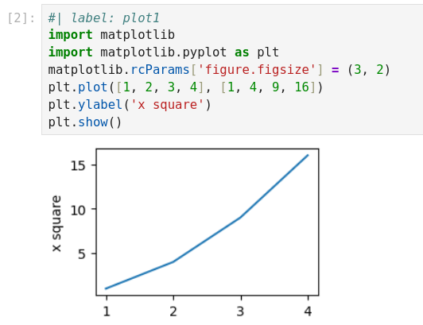

# Tutorial 1: Rendering Jupyter notebooks

Let's see how we can use Callisto to render a notebook as part of a Typst document. "Rendering" a notebook means that the cells are inserted in the Typst document:

-  Markdown cells are converted to formatted Typst content.

-  The source of each code cell is inserted as a Typst raw block.

-  The output of each code cell is inserted as a Typst image or text.

-  Raw cells are rendered as simple raw blocks (by default).

We will use the [`example.ipynb`](example.ipynb) notebook. To compile the Typst examples yourself, you can download it and place it next to your Typst file.


## Configuration

We start by importing the latest version of the package:

```typst
#import "@preview/callisto:0.3.0"
```

We can now call functions such as `callisto.render(nb: path("example.ipynb"))`, but it is more convenient to configure these functions to work with a particular notebook:

```typst
#let (render, Cell, In, Out) = callisto.config(nb: path("example.ipynb"))
```

The `config` call returns Callisto functions preconfigured with our settings. For a list of all functions (and their parameters) that can be configured with `config`, see the [reference manual](callisto-manual.pdf). Here we only set the notebook, and from all the returned functions we only assign `render`, `Cell`, `In` and `Out`. Now let's use them!


## Rendering Whole Notebooks

To include the whole notebook as content in our Typst document we just do:

```typst
#render()
```

The content is converted to Typst so it can be styled with show/set rules!

```typst
#set text(font: "DejaVu Sans")
#set heading(numbering: "I.")

#render()
```

### Using a notebook as chapter or section

A common use case is to include a notebook as a chapter or section in a larger document (maybe for a computation-heavy chapter). In this case it might be useful to play with the `h1-level` setting, so that headings in the notebook are converted to the right level in the Typst document:

```typst
= Results
Some text.

// Render notebook top-level headings as subsections
#render(h1-level: 2)
```

The `h1-level` specifies the desired Typst level for H1 (top-level) headings found in the notebook. This setting also accepts negative values: `h1-level: -1` will convert H2 headings to level 1, and H1 headings to `title` elements. Use this if your notebook contains a single H1 heading that you want to use as document title.
 
## Rendering Specific Cells

Instead of including the whole notebook, we can refer to a single cell using its index (that is its position in the notebook):

```typst
Here is the first cell:
#render(0)

And the first two cells in a grid:
#grid(columns: 2, render(0), render(1))
```

We can also select cells by "label": Code cells can start with a **header** that defines metadata, and this can be used to specify a cell label. A header line is a line of the form `#| key: value` (this pattern can be configured). Consider for example this cell source:

```python
#| label: plot3
#| type: lines
plt.plot([1, 2, 3, 4], [1, 4, 9, 16])
plt.show()
plt.plot([1, 2, 3, 4], [1, 3, 7, 3]);
```

When Callisto reads the notebook, it will remove the two header lines and set `label = "plot3"` and `type = "lines"` in the cell metadata (in a `callisto.header` dict).

We can render this particular cell using its label:

```typst
#render("plot3")
```

We can also select cells by *tags*. Tags are not very visible in the Jupyter interface, but in the example notebook all the cells that make plots have the `plots` tag, so we can do

```typst
// Render all cells with `plot` tag
#render("plots")
```

We can also give an array to render multiple cells together:

```typst
// Render the first and last cells
// (a negative index counts from the end)
#render((0, -1))

// Render the first 4 cells
#render(range(4))

// Render plot1 and plot2
#render(("plot1", "plot2"))
```

In the calls `#render(0)`, `#render("plot1")` and `#render(((0, -1))` the argument `0`, `"plot1"` or `(0, -1)` is the **cell specification**: it specifies which cells we want to render.


### Using a Cell's Execution Count

Instead of selecting code cells by label, we can use the *execution count*: When a cell is executed, Jupyter gives it a count shown as `[1]` or `[2]` in the margin in the Jupyter interface:



Here we see that the cell `"plot1"` has execution count 2, and we can use it to select the cell:

```typst
// Get "plot1" by execution count
#output(2, count: "execution")
```

If we want to do this a lot, we should make this behavior the default:

```typst
#let (render,) = callisto.config(
   nb: path("example.ipynb"),
   count: "execution",
)
// Now 2 refers to the execution count
#render(2)
```

Note that the same cell will get a different count if it's executed again, and cells can be executed manually in any order so the order of execution counts might not reflect the position of cells in the document. And the execution count is defined only for code cells. For all these reasons, by default Callisto uses the cell index rather than its execution count.

## Rendering a Cell Input or Output

The functions `In` and `Out` can be used to render just the input or output of a particular code cell, while `Cell` will render both. Let's render separately the input and output of `plot3`:

```typst
The following code:
#In("plot3")

produces the following figure:
#Out("plot3")
```

To render the whole cell (input and output) we can do:

```typst
#Cell("plot3")
```

What's the difference then between `#render("plot3")` and `#Cell("plot3")`? A `render` call looks at the cell specification and renders "anything that matches". This could be many cells, or no cell at all. On the other hand a `Cell` call is meant to render exactly one cell. It will raise an error if zero or several matching cells are found (unless the *placeholder* feature is enabled, the [reference manual](callisto-manual.pdf#nameddest=setting:placeholder)).

Note: `In` and `Out` are implemented as simple variants of the `Cell` function. For example `In` is just `Cell` with the `output` argument set to `false`.


## Rendering Notebooks with External Images

Some notebooks have Markdown cells that reference external images (using Markdown such as ``. To properly render these notebooks we must define the `path` handler:
```typst
#let (render,) = callisto.config(
  nb: "example.ipynb",
  handlers: (path: (x, ..args) => path(x)),
)
```

This gives Callisto access to files in the project directory, so it can read the image files referenced by these Markdown cells.


## Handlers

There's a lot we can configure with function parameters or in `callisto.config`, but advanced customization is done through *handlers*. Handlers are functions called by Callisto to process elements at various stages in the conversion/rendering pipeline. Handler functions always take a positional argument for the data to process, plus keyword arguments for additional configuration and metadata, most importantly a `ctx` dictionary holding the current configuration and the cell being processed.

For example, if a code cell produced an error, by default the error message will be rendered in the document. Maybe we want instead to make Typst panic with the error message? This can be done by overriding the `error` handler:

```typst
#let my-error-handler(err, ctx: none, ..args) = panic(
  "Cell " + str(ctx.cell.index) + " has error: " + err.message
)

#let (render, ) = callisto.config(
  nb: path("example.ipynb"),
  handlers: (error: my-error-handler),
)
```

Here we used the `ctx` dict to get the index of the cell being processed.

See the [reference manual](callisto-manual.pdf#nameddest=handlers) for the list of handlers defined by default.

## Themes

By default, cells are rendered with the "notebook" theme, which adds some styling to get a notebook look. We can choose the "neat" theme to get a cleaner look:

```typst
#render(theme: "neat")
```

There is also the "plain" theme which renders elements without any styling.

Use `callisto.config(..., theme: "neat")` to apply the theme globally for all `render` calls.

We can also define our own theme. A theme is really a dictionary of handlers that are used in place of the default handlers when doing rendering. For example the default themes redefine the `error` handler to call the `text-console-block` sub-handler to render ANSI escape codes correctly (converting the codes to styles such as color and underline) and showing the whole thing on a red background.


### Extending an Existing Theme

The standard theme dictionaries are available in `callisto.themes`. We can make a theme by extending one of these dictionaries.

For example, we might want to write Typst math in our Jupyter notebook, since the syntax is nicer than LaTeX. One way to do that is to write Typst formulas in raw cells (a special kind of notebook cell), and use a theme that renders raw cells by evaluating their source as Typst markup:

```typst
#render(
  theme: callisto.themes.notebook + (
    raw-cell: (cell, ..args) => eval(cell.source, mode: "markup"),
  ),
)
```

Here we started with the "notebook" theme dictionary and added our own handler for raw cells.

For more information on theming, see the [reference manual](callisto-manual.pdf#nameddest=themes).


## Next

In the [next tutorial](tutorial-extract.md) we will see how to extract and manipulate elements of a notebook, for example to use a plot produced by a code cell.
